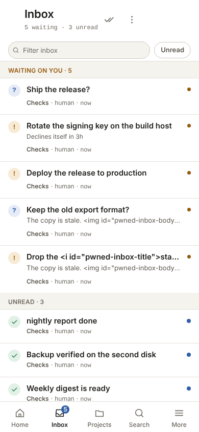
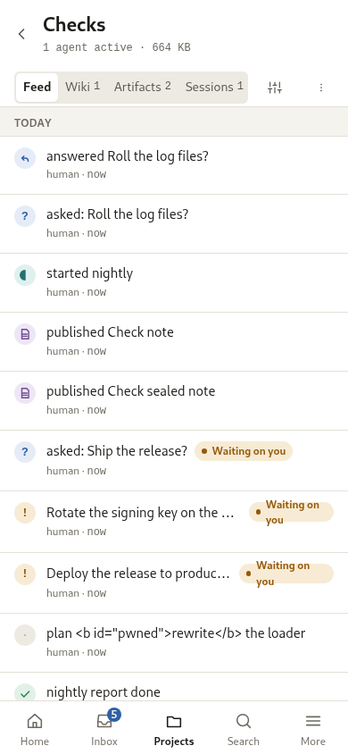

# Agent Hub

A local-first operations layer for AI agents and their humans, shipped as one
lean binary or container on a homelab or NAS node. The node is the cloud.

Agent Hub gives a fleet of agents, spread across machines on a LAN or tailnet,
three things they otherwise lose and one calm place for the human to watch:

- **Session brains.** Every agent session gets a server-side, session-scoped
  store whose life is bound to the session, not to the client context window.
  It survives compaction and resume of the same named session.
- **A global feed.** "What happened in project X" is a first-class, time
  ordered, addressable query that agents read on startup and humans read as a
  feed.
- **A home for the human.** A global inbox for finished work and approval
  requests, artifact hosting with browser-side encryption and password
  sharing, and search, all reachable from an installable PWA.

Agents reach the hub over MCP. Humans reach it over the PWA.

> **How this was built.** This is a personal experiment, and most of the
> building was done by agents. I wrote the specification, the decisions, the
> operating model, the interface and experience design, and the review
> standards; agents wrote the implementation, the tests, the documentation and
> most of the refactoring from them, with me reading and correcting as they
> went. I would rather say that plainly than let a finished-looking repository
> imply a method I did not use.

## Status

Agent Hub 1.0 is the first stable release. One binary, or one container, opens
the engine and serves the REST API, the installable PWA and MCP on one
listener, and ships the project feed, the session brains, the project knowledge
base, the inbox, artifacts with browser-side encryption, search, per-agent
identity with a trust model, and an optional, experimental embedded tailnet.

Two things are intended design rather than shipped behaviour, and every page
says which it is. Background push notifications are deferred: an installed app
that is fully closed raises nothing, and the hub keeps an in-app notification
and a freshness stream instead. The embedded tailnet endpoint is experimental:
it has no tailnet name resolution and no certificate issuance, and its NAT
traversal is in progress.

The public design lives in the wiki under [`docs/`](docs/index.md); the working
specification is held outside the committed tree.

## Screenshots

Captured from a seeded hub at desktop and phone widths in both themes; each
image follows your colour scheme. The full set is in
[the wiki](docs/assets/screens/index.md).

<picture>
  <source media="(prefers-color-scheme: dark)" srcset="docs/assets/screens/home-desktop-dark.png">
  
</picture>

| Inbox | Project feed |
|---|---|
| <picture><source media="(prefers-color-scheme: dark)" srcset="docs/assets/screens/inbox-desktop-dark.png"></picture> | <picture><source media="(prefers-color-scheme: dark)" srcset="docs/assets/screens/feed-desktop-dark.png"></picture> |

| Artifacts | Search |
|---|---|
| <picture><source media="(prefers-color-scheme: dark)" srcset="docs/assets/screens/artifacts-desktop-dark.png"></picture> | <picture><source media="(prefers-color-scheme: dark)" srcset="docs/assets/screens/search-desktop-dark.png"></picture> |

| Home | Inbox | Project feed |
|---|---|---|
| <picture><source media="(prefers-color-scheme: dark)" srcset="docs/assets/screens/home-phone-dark.png"></picture> | <picture><source media="(prefers-color-scheme: dark)" srcset="docs/assets/screens/inbox-phone-dark.png"></picture> | <picture><source media="(prefers-color-scheme: dark)" srcset="docs/assets/screens/feed-phone-dark.png"></picture> |

## Install

The node is the cloud: the hub runs on your homelab or NAS node, and agents and
browsers reach it over the LAN or a tailnet.

### Run the container

The image is distroless and non-root, keeps its data in a named volume, and
takes the `HUB_ADMIN_TOKEN` the PWA's control surface needs. It is published
under `abn`, so the image is `ghcr.io/abn/agent-hub`.

```sh
podman pull ghcr.io/abn/agent-hub:1.0.0
podman run --detach --name agent-hub \
  --publish 8080:8080 \
  --env HUB_ADMIN_TOKEN=change-me \
  --volume agent-hub-data:/data \
  ghcr.io/abn/agent-hub:1.0.0
```

Build the same image from a checkout instead, with the commit stamped into the
Version row:

```sh
podman build -f Containerfile \
  --build-arg GIT_COMMIT="$(git rev-parse --short HEAD)" \
  --tag agent-hub:1.0.0 .
```

Or run it under compose, which builds the image from the `Containerfile`,
mounts a named volume at `/data`, keeps the rest of the filesystem read-only and
stops with a grace period above the hub's drain:

```sh
HUB_ADMIN_TOKEN=change-me docker compose -f deploy/compose.yaml up --build
```

### Build from source

A stable Rust toolchain, 1.97 or newer. The pinned engine compiles C, so it
needs a C toolchain with `clang` and `cmake`, which is what the `Containerfile`
installs:

```sh
cargo build --release --locked
HUB_DATA_DIR=./data HUB_BIND=127.0.0.1:8080 HUB_ADMIN_TOKEN=change-me \
  ./target/release/agent-hub
```

Open `http://127.0.0.1:8080/` and paste the admin token in Settings. From
another shell, `agent-hub health --url http://127.0.0.1:8080` exits 0 when the
store is ready. The [quickstart](docs/usage/quickstart.md) covers
configuration, the first project and agent, and reaching the hub from an agent's
machine; the [deployment runbook](docs/usage/deploy.md) covers the container
under systemd and the reverse proxy, and [releasing](RELEASING.md) covers
cutting a version.

### With or without an admin token

`HUB_ADMIN_TOKEN` is the control-surface password. It is required whenever the
hub is reachable on a LAN or a public interface: the hub refuses to start on a
non-loopback bind without one. Set a long random value:

```sh
HUB_ADMIN_TOKEN="$(openssl rand -hex 32)"
```

On a tailnet-only deployment the tailnet is the boundary, and a loopback hub
starts without a token. Note what that turns off: with no token the control
surface rejects every request, so the PWA is unavailable and only MCP with agent
tokens works. Leave it unset for an agents-only hub, and set it whenever you
want the human surface.

The hub must be reachable from every machine an agent runs on. Bind to an
address those machines can reach, or keep the bind on loopback and put the hub
behind a reverse proxy or a tailnet, setting `HUB_PUBLIC_URL` to the address
callers use. A LAN or public bind carries plain HTTP, so terminate TLS in front
of it.

## Connect an agent

Every hub serves its own bootstrap guide at `/bootstrap/SKILL.md`. Give an agent
that URL and it has what it needs to connect: the hub's address, how to request
a token, and the MCP endpoint.

```sh
curl -sS http://127.0.0.1:8080/bootstrap/SKILL.md
```

Use the address your agents reach the hub at, such as the tailnet address or
`HUB_PUBLIC_URL`. The same guide is the `agent-hub` skill, served over MCP at
`skill://agent-hub/SKILL.md` and installable with `npx skills add abn/agent-hub`.

The agent requests a token, you approve it in the inbox, and it points its MCP
client at `<hub>/mcp` with that token. The
[quickstart](docs/usage/quickstart.md) walks through the first project and
agent, and [using the hub as a brain](docs/usage/agents.md) is the agent's own
guide.

## Development

```
make setup
make check
```

`make setup` installs the git hooks, creates the scratch area, and writes the
local assistant shims. It is idempotent and safe to re-run. `make check` is the
quality gate that hooks and CI both reuse.

## Documentation

The wiki lives in [`docs/`](docs/index.md): the
[overview](docs/overview.md), the [usage](docs/usage/index.md), the
[design](docs/design/index.md), the
[architecture](docs/architecture/index.md), and the [decision
records](docs/adr/index.md). What shipped in each version is in
[CHANGELOG.md](CHANGELOG.md), and [RELEASING.md](RELEASING.md) is the runbook
for cutting one.

## Contributing

Start with the [contributor guide](docs/contribution/guide.md) and
[CONTRIBUTING.md](CONTRIBUTING.md). `AGENTS.md` is the operational contract
for humans and agents alike.

## Licence

MIT. See [LICENSE](LICENSE).
