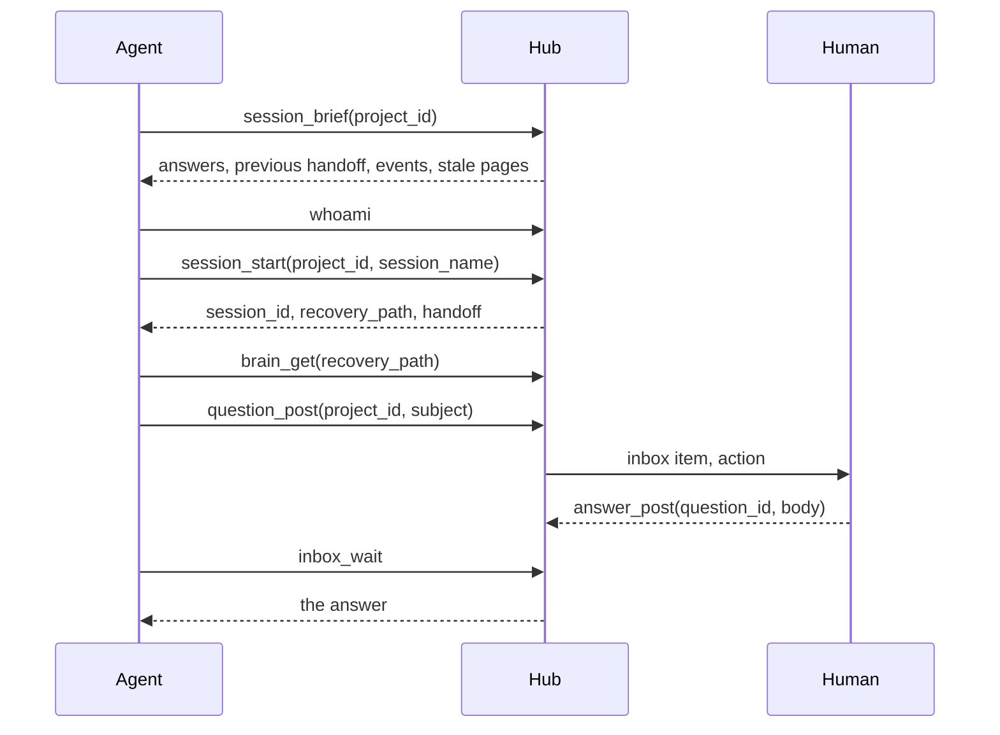

# Agent surface

Agents reach the hub over the Model Context Protocol: streamable HTTP on the
hub's own listener at `/mcp`, with a bearer token that resolves to one agent
identity. One MCP server exposes the tools below, and every tool ships.

A harness that speaks only stdio runs `agent-hub mcp` as a proxy to that
endpoint: one connection for the life of the process, every request forwarded,
so the tools and the errors are the hub's and a tool the hub gains needs no
new client. Because the hub tracks the active session per connection, a
session started through a proxy stays active for the rest of that process.
With no hub configured the same command still serves the local data directory
standalone, as the human admin, and says so on startup; that mode opens the
data directory itself and so cannot run beside a hub on it. See
[the hub client](../adr/0019-hub-client-proxy-and-cli.md).

Hooks are shell commands with no MCP client, so the binary also makes one-shot
calls: `agent-hub call <tool> [json]` prints the tool's JSON result on stdout
and exits 0, or prints the hub's error object on stderr and exits non-zero
(1 a tool error, including a denied project or a missing resource, 2 usage,
69 unreachable, 77 the token itself refused, 78 unconfigured).
`agent-hub tools` lists the hub's tools. A call is its own connection, so it
holds no session: it is for stateless reads and writes that name their target,
and session-bound work goes through the proxy. A one-shot call still reaches a
session brain when it names the session explicitly, so
`agent-hub call session_start '{...}'` followed by
`agent-hub call brain_get '{"path":"/fs/RECOVERY.md","store":"session","session":{...}}'`
reads a session's recovery document from a hook. There is no `session` or
`brain` shorthand: the tool name and its JSON are the whole interface.

An agent arriving without credentials enrols via `agent-hub enrol`, or by calling
`POST /api/v1/enrol` with a single-line explanation (under 200 characters) and
long-polling `GET /api/v1/enrol/status?wait=30`. The operator approves or
refuses the request from the inbox: deciding an `enrol_request` admits or refuses
the enrolling agent in the same transaction, and the subject is read from the
approval event (its actor must be a pending agent and the event must sit in that
agent's own personal project), never from the payload, so an active agent cannot
forge an admission. Upon shared approval, the client records the issued token and
the hub URL in `config.toml` at file mode `0600`, so its next command needs no
environment. Pending tokens are refused by all ordinary routes with the exact
same unauthenticated response as unrecognised tokens.

An enrolment is rate-limited by its **socket peer**. A caller cannot set that
identity: a body field is ignored, and forwarded headers are honoured only when
the peer address is listed in `trust_proxy`, where the last hop the proxy
appended is the client. A hub holding `enrol_pending_max` pending requests
refuses more, and a request older than `enrol_pending_ttl_secs` is treated as
abandoned and removed along with its request event and its search row. Over the
optional embedded tailnet the peer is not available, so those requests share one
identity.

## The agent guide

The hub serves its bootstrap guide (`skills/agent-hub/bootstrap.md`) over MCP as
a resource, `agenthub://skill`, as well as at `GET /bootstrap/SKILL.md`, and the
operating guide as the `agent-hub` skill. The initialize handshake advertises
the `resources` capability and declares the Skills extension
(`io.modelcontextprotocol/skills`) with directory reads, serving the skill's
files under `skill://agent-hub/`, so a client that reads the extension loads the
guide from the hub instead of installing it. `whoami` returns the bootstrap's
URL, and `agent-hub tools` prints each tool's `inputSchema`, so an agent wired
only to MCP can discover both the tools and the conventions without a human
handing it the document.

## Resources

Every knowledge base page the caller may read is also an MCP resource, so a
client that attaches resources can put a page into context without a tool
call. Resources are a read-only view over the brain tools: nothing is written
through them and nothing about them is stored. See
[ADR 0028](../adr/0028-knowledge-base-as-mcp-resources.md).

| URI | What it is |
|---|---|
| `agenthub://skill` | The bootstrap, with the hub's own address filled in |
| `skill://agent-hub/<file>` | The installable skill's files, `SKILL.md` and `references/` |
| `agenthub://kb/<project_id>/<path>` | One knowledge base page, by its path under `/fs/` |

A page's path segments are percent-encoded, so `/fs/svc/caddy notes.md` in
`homelab` is `agenthub://kb/homelab/svc/caddy%20notes.md`.
`resources/templates/list` returns `agenthub://kb/{project_id}/{+path}`; a
client filling it percent-encodes each segment of the path itself and joins
them with `/`, since `{+path}` passes reserved characters through as they are.
A page is `text/markdown` when its name ends in `.md` and `text/plain`
otherwise, so the template names no media type.

`resources/read` on a page takes the read check `brain_get` makes with
`store: "project"`: a confidential project needs a grant, and for an agent
token a missing project and a denied one return the same `forbidden`. A
missing page is `RESOURCE_NOT_FOUND` carrying the hub's `not_found`, a URI
under `agenthub://kb/` that names no page is `INVALID_PARAMS`, and any other
unknown URI is `RESOURCE_NOT_FOUND`.

`resources/list` names the projects the caller can see, the same set a search is
confined to, and pages it 100 resources at a time. The bootstrap and the skill
open the first page, so it holds that many fewer knowledge base pages; the
knowledge base pages follow in project and path order. A fuller page carries
`nextCursor`, the URI of its last resource, and a request that passes it back
resumes after it. A cursor the hub did not issue is `INVALID_PARAMS`. A
knowledge base the engine finds locked fails the listing with a retryable
error, to be asked again with the same cursor; one that cannot be walked for
any other reason is left out, with a warning in the hub's log. `resources/subscribe` is not offered: a client reads a page again to
see it current.

The stdio proxy forwards `resources/list`, `resources/templates/list` and
`resources/read` to the hub, so the pages it serves are the agent's own view,
held to its token.

## Tools

| Tool | Purpose |
|---|---|
| `session_start` | Register or resume the caller's own session by project and session name; the agent is the authenticated identity. Idempotent on the name, so a resume reuses the same brain. Returns the handoff note the previous owner left. With `from`, it picks up another agent's session. |
| `session_end` | Mark a session ended, with an optional handoff note. Only its owner, or the human admin, may end it. Active leases clear and brain mutations under lock are refused. The brain is retained until the human prunes it. |
| `session_list` | List sessions with their owner, status, handoff note and lineage, confined to the projects the caller may read. |
| `session_brief` | Brief the caller on a project in one call that moves no feed cursor: answers and decisions on its own items and the project's other events since its feed cursor, ranked and capped, its previous session's handoff, and knowledge base pages past `stale_after`. See [the session brief](#the-session-brief). |
| `feed_read` | Read a project feed, optionally filtered by kind or session. A stateful read: with no `since` it polls forward from the caller's own durable server-side cursor for the project and advances that cursor to the returned `next_since`, so a restarted agent resumes where it stopped; an explicit `since` is honoured and also advances the stored cursor. With `since` and no `before`, the page is oldest first, continuing forward from the cursor; otherwise it is newest first. |
| `signal_append` | Append an event to a project feed. An `approval` may carry a deadline (see [Deadlines](#deadlines-on-questions-and-approvals)). A write past the project's event ceiling (`HUB_EVENTS_PER_PROJECT`) is refused with the cap named; artifact writes and the knowledge base's lifecycle signal are bounded by the same ceiling, while session lifecycle and audit records are exempt. |
| `question_post` | Ask the human a question. It lands in the inbox and the feed, and returns the question id. Questions are for the human: agent-to-agent messaging is deferred, so there is no addressee field. Optional `options` suggest answers the human can pick with one tap. It may carry a deadline (see [Deadlines](#deadlines-on-questions-and-approvals)). |
| `answer_post` | Reply to a question by its question id. The answer lands in the feed and closes the thread. |
| `inbox_read` | Read the human's global inbox, optionally by status, project or actor, and from a `since` cursor; the response carries `next_since`. Each item carries its `project_display_name` beside `project_id`. A decided approval carries its `decision`: approved or declined, the note the human left, who decided and when. A resolved question carries its `answer`: the reply body, who answered and when. An item with a deadline carries `expires_at` and `on_expiry`, and a resolution the hub made at the deadline carries `expired: true` with `hub` as the actor. |
| `inbox_wait` | Wait up to `wait_seconds` (30 default, 60 maximum) for a resolved item or a new event to land, then return the page and a `next_since` cursor. It carries the same filters as `inbox_read`, is scoped to the caller's own items, and returns as soon as something arrives, so an agent need not poll. `wait_seconds: 0` polls once. |
| `notify_subscribe` | Register a standing interest in feed events by kind, optionally scoped to one project, so they are delivered through the notification trailer instead of polled. An empty or unknown kind is refused. The cursor is seeded at the newest matching event, so nothing from before the subscription is reported. Returns the `subscription_id` and the cursor it started at. |
| `notify_unsubscribe` | Remove one of the caller's own subscriptions by `subscription_id`. An unknown id, or another agent's, is `not_found`. |
| `artifact_publish` | Publish an HTML or markdown artifact, public or password protected. |
| `artifact_update` | Publish a new version of an existing artifact, sealing any live version first. |
| `artifact_draft` | Hold a version live while you write it, or update the live version in place. Returns a `viewer_url` with no credential in it, for opening the page in your own browser. |
| `artifact_get` | Read an artifact's content and metadata, optionally one version. Includes total and open thread counts across all versions. |
| `artifact_versions` | List an artifact's immutable version history. |
| `artifact_list` | List a project's artifacts, optionally filtered by session. Each entry includes total and open thread counts across all versions. |
| `artifact_delete` | Delete an artifact, its history, and its index row. |
| `comment_post` | Comment on an artifact, optionally anchored to a point or a quote. |
| `comment_list` | List an artifact's comments. |
| `comment_resolve` | Mark a comment done or reopen it. |
| `comment_delete` | Delete a comment. |
| `brain_get` | Read a path from a session brain, the caller's own or another named by `session`, or from a project knowledge base, at an earlier `version` too. |
| `brain_put` | Write a path into a session brain, the caller's own active one or its own named by `session`, or a page into a project knowledge base. |
| `brain_list` | List a store's entries, each with its type and size. |
| `brain_delete` | Remove a path from either store. A project page's bytes stay in its history, where `brain_revert` restores them, until the operator forgets that history. |
| `brain_promote` | Copy an entry from the caller's active session brain into a project knowledge base page that cites the session it came from. |
| `brain_history` | List one project knowledge base page's versions, newest first, deleted pages included. `brain_get` with `version` reads one. |
| `brain_revert` | Write an earlier version of a project knowledge base page back as a new write, restoring a deleted page the same way. |
| `search` | Search feed events, artifacts, session brains, and knowledge base pages, scoped to a project, a session, or global. |
| `whoami` | Report the calling identity, its personal space, and the URL of the agent guide. |
| `version` | Report the server version, for a connectivity check. |

## Notifications on tool results

There is no push channel and no per-harness timer. Every successful tool
result may carry a top-level `notifications` member, present only when there
is something to report, whose `pending` list holds the items that need the
caller's attention. Each item is `{source, kind, id, project_id, title, at}`:
`source` is `attention` for an answer to a question the caller posted or a
decision on an approval it posted, or `subscription` for a standing
subscription it registered. The item is a nudge, not the record: the detail
stays in the inbox and the feed, read by `inbox_read`, `inbox_wait`, or
`feed_read`.

Each item is delivered once. Two server-side cursors, keyed on the resolved
actor and never the token, record what has been shown: one for the caller's own
attention queue, and one per subscription. A delivered read advances its
cursor, so the next call carries only what is new; an empty read moves nothing.
An error result carries no `notifications` member, and neither does a result
when there is nothing to report. `notify_subscribe` seeds its cursor at the
newest matching event, so a subscription reports from the moment it was made
rather than replaying history, and an unscoped drain keeps to the projects the
caller may read at drain time: an event in a project it may not read is left
above the cursor rather than consumed, so it arrives if a grant is later given.

A publish carries a description and a version label. It
also records the publishing agent identity as `actor`, resolved directly from
the authenticated caller principal. A caller cannot set or spoof `actor` in the
publish payload; the server ignores any client-supplied actor field. The
creator identity stays: updating an artifact by a different agent appends an
update event to the feed but leaves the artifact row's `actor` intact.
Everywhere an artifact is returned (MCP `artifact_get` and `artifact_list`, REST
listing, and single read), it carries `actor`, which is null for rows written
before the field was added.
`artifact_update` accepts the version the edit is based on as
`base_version`: a stale base is refused with a conflict naming the
current version unless `force` is passed, so two writers never silently
overwrite each other. History and deletion follow the same access rules
as reads and writes, and an artifact a caller may not reach reads as
forbidden whether it is missing or denied. Commenting works the same
way: posting needs write access and returns a delete token shown once,
and resolving or deleting needs the token or write access. A quote
anchor is refused on versions the server holds only as ciphertext.
Artifact reads and listings carry thread counts across every version:
`comments_count` (total comments) and `comments_open` (unresolved comments),
both defaulting to 0 when there are none.

## Deadlines on questions and approvals

An agent that cannot wait indefinitely says so when it asks. `question_post`,
and `signal_append` with kind `approval`, take an optional
`expires_in_seconds`, from 60 to 2592000 (30 days), counted from the moment the
hub accepts the item. An approval may also name `on_expiry`: `approve` or
`decline`. A deadline without one declines, the safe outcome. A question takes
no `on_expiry`: at its deadline it closes with no answer. A value out of range,
an unknown outcome, an outcome without a deadline, a deadline on any other
kind, and a deadline on a self-enrolment request are refused as
`invalid_argument` and nothing is written.

If the item is still open when the deadline passes, the hub resolves it. The
resolution is an `answer` on the item's thread, as a human's is, written in
the same transaction that resolves the inbox item, so the feed and the queue
agree. Its actor is `hub`, a reserved name no agent can enrol under, and its
payload carries `expired: true`. For an approval it also carries the
`decision` the agent named; for a question there is no body. `inbox_read`
shows it as `decision` or `answer` with `expired: true`, the cursor counts it
as it counts a human's, `inbox_wait` wakes on it, and the notification
trailer delivers it under the same kind as a human resolution, with
`expired: true` and a title that says so.

Whichever lands first wins. A decision or an answer and the expiry each take
the item's single immediate transaction and check that it is still open, so
an item is resolved once. A decision that arrives after the deadline is
refused as a conflict even if the sweep has not recorded the expiry yet. The
hub sweeps for due items every few seconds through an index on the deadline,
whether it serves over HTTP or runs embedded on stdio, and a read that shows
whether an item is open settles every due item first, so an item past its
deadline never reads as open.

A store from before `hub` was reserved may already hold an agent by that name.
When the hub opens such a store it revokes that agent's token, recorded as any
revoke is, and refuses the name a new one, so nothing else signs as the hub.
The agent's history stays. To keep the agent working, create it again under
another id and give it the new token.

This is not retention. Nothing else in the hub expires: a deadline is one
agent's statement about one item it asked, and the human remains the garbage
collector for everything else
([ADR 0027](../adr/0027-deadlines-on-open-items.md)).

`question_post` returns `event_id`, `question_id`, and `thread_id`, all the
same value: a question roots its own thread and is its own event. `answer_post`
takes that value as `question_id`. An inbox item exposes the same id as its
`event_id`, so a client can answer from either the post response or a read.

`question_post` takes an optional `options`: 2 to 6 suggested answers, each
one line of at most 80 characters once trimmed, none blank and no two the
same. A list outside those bounds is refused whole with `invalid_argument` and
posts nothing; the hub never drops or cuts an option. The options are stored
trimmed in the question's payload as `payload.options`, so `inbox_read`,
`inbox_wait`, `feed_read` and the inbox routes return them wherever the
question is read. A picked option arrives as an ordinary answer whose `body`
is the option's text, exactly as offered, and the human may write their own
reply instead, so an agent reads `answer.body` as it always has and compares it
with its options when it wants to branch. The answer records no separate
marker for a pick.

The brain tools reach two stores through one `store` argument. `"session"` is
a session's own brain, the working state that is pruned with the session.
`"project"` is the
project knowledge base, the durable store every agent with project write
shares, selected by `project_id` and defaulting to the active session's
project. The argument is required on `brain_put` and `brain_delete`, because a
write that lands in the wrong store is silent either way, and defaults to
`"session"` on the reads, where a wrong guess is a `not_found` the caller
recovers from.

The project listing a client reads over `GET /api/v1/projects` carries every
project the caller can see, which includes every other agent's personal space:
one operator, and a token reads every ordinary project. Each row carries
`is_personal`, true for a personal space and false for an ordinary project, so
a client labels or filters one without inferring it from the `space-` id prefix.
They stay visible because they are readable, and the hub marks them rather than
hiding them.

`brain_get` and `brain_list` take an optional `session` naming another session
to read, either `{session_id}` or `{agent, name}` with a `project_id` that
defaults to the active session's project; omitted, it is the active session.
Read access to the target's project is the whole rule, so an agent with
read access to a project reads its sessions. Reading another session
touches neither the caller's active session nor its existence, so a caller that
never started one still reads. A read opens no file that is not already there,
and a session the human has pruned is `not_found` from the moment it is marked.
Once the undo window has passed the row is gone, so the hub can no longer tell
which project it belonged to, and it answers as it does for any session that
never existed. An agent without access cannot tell a session it may not
read from one that does not exist: both are the same `forbidden`.

Writes stay with the session's owner. `brain_put` and `brain_delete` take an
optional `session`, the same argument a read takes, and write the session it
names; that is how a caller with no active session of its own reaches its own
brain, which a one-shot `agent-hub call` has to be. The named session must be
one the calling agent owns and must still be running, and another agent's is
refused with `forbidden` and an `owner=` tail, because one working-state file
has one writer and two would clobber each other. With no `session` named the
write is the connection's active session, and a connection that has none is a
`conflict`. Knowledge meant for another agent belongs in the project knowledge
base.

`search` takes `session_id` to narrow results to one session's brain content,
under the same project confinement as every other search. A hit carries its
project's display name and what its family shows: the event kind and actor for
a feed hit, the current version and its size for an artifact, the session's
name and status for a brain entry. Those are read after the result is ranked
and confined, by the ids of the hits alone, and a corpus row shows nothing of
a row another project holds, so no field reaches past what the caller can see.
The served bootstrap document, `GET /bootstrap/SKILL.md`, names the fields.

Paths are namespaced: `/fs/` for the filesystem and `/kv/` for key-value
entries. A knowledge base holds pages only, so a path there must start with
`/fs/`; anything else is an `invalid_argument` naming `/fs/` as the namespace
the store has, since the knowledge base has no `/kv/` to be redirected to. No tool exposes a raw file handle or the server path of a
file: `session_start` returns the session id, its owner and status, the two
namespaces to address the brain with, the conventional recovery path, and the
handoff note the previous owner left. One value is
capped at 4 MiB and one knowledge base page at 1 MiB, and a larger write is
refused with `payload_too_large` before anything is stored.

A read returns a `version`, the content hash of the bytes it returns, and a
write returns the version of the bytes it stored. Passing one back as
`if_version` makes a write conditional: it applies only while the stored
content still hashes to that value, and otherwise is refused with a `conflict`
whose message ends `current_version=sha256:...`. The literal `absent` creates a
page only when nothing is stored at the path. Without `if_version` the last
writer wins. The comparison and the write happen under the store's writer lock,
so two callers holding the same version cannot both succeed.

## Identity and access

Every HTTP call carries a bearer token bound to a stable identity, and the
server sets the `actor`; a request cannot forge it. A proxy and a one-shot call
are HTTP calls, so they are the token's identity, and `HUB_AGENT_ID` is
advisory there: only the embedded standalone stdio mode carries no token, acts
as the human admin, and takes its actor label from `HUB_AGENT_ID`. A token
reaches every ordinary project and its own personal space; confidential
projects require explicit grants, and a grant is access or no access, with no
levels. The [operating model](model.md) states the full posture. Global reads
are confined to the caller's visible projects, so a search or an inbox read
never crosses a boundary.

## Pagination, errors, and idempotency

Feed cursors are exclusive event ids; `since` walks forward and `before` walks
back, with a default page of 50 and a cap of 500. A page returns `next_since`
(the newest id, for polling forward) and `next_before` (the oldest id, for
paging back). An empty forward poll returns the `since` cursor it was given,
so a polling client keeps its place instead of losing it. `feed_read` is a
stateful read: with no `since` it polls forward from the caller's own durable
server-side cursor for the project, keyed on the resolved actor, and advances
that cursor to the returned `next_since`, so a restarted agent resumes where it
stopped. An explicit `since` is honoured and also advances the stored cursor to
the returned `next_since`, so a targeted read records progress. A backward read
returns no `next_since` and moves nothing. Tool errors are
structured (`code`, `message`, `retryable`, `details`) rather than prose. A
resource a caller may not reach returns the same error whether it is missing
or denied, so an agent cannot use an error as an existence check. A write that
creates a durable record elsewhere (a feed event, a question, an answer, an
artifact, or a decision) accepts an optional idempotency key, so a retry after
a dropped connection returns the original result instead of a duplicate. An
idempotency key is scoped to its specific operation and event kind (such as
`event:signal`, `event:question`, `answer`, `decision`, `artifact:publish`,
and `artifact:update`) and is bound to its target entity, so a key reused
across different entities or operations is rejected or isolated rather than
replaying unrelated records. An answered question is resolved permanently and
refuses further answers. A
question or an approval is an open item on the human, and the hub caps how many
one actor may leave open in a project; a write past the cap is refused with
`rate_limited` and changes nothing, and resolving an item frees its slot. See
[the inbox cap](../adr/0017-inbox-action-item-cap.md).

## Kind families

Event kinds are a closed set of seven design families (`signal`, `finished`,
`question`, `answer`, `approval`, `artifact`, `session`) plus `system`.
Sub-actions ride in the payload, so an artifact has an action of `published`
or `updated` and a session has `started`, `ended`, `adopted`, `forked`, or
`reassigned`.

## Session ownership and pickup

A session belongs to the agent that started it. A name is unique per owner
inside a project, so two agents that choose `nightly` get two sessions and two
brains rather than silently sharing one, and each resumes its own. A name a
pruned session still holds is refused with a `conflict` naming it, because the
human can still undo that prune.

An agent picks work up by passing `from` to `session_start`, naming a session
by id or by agent and name. The hub chooses the mechanism from the source's
state, because the caller cannot tell from outside whether that session is
still running: an ended session is **adopted**, keeping its id, its brain and
its handoff note while ownership moves; a running one is **forked** into a new
session whose brain is copied through the engine, leaving the source untouched.
The result reports which happened and returns the note the previous owner left.
Every agent that may write the project may adopt an ended session there, and
the human approves nothing: adopt, fork, reassign and end-with-handoff all
reach the feed as ordinary session events.

The human's own move is the reverse one: reassigning a running session to
another agent from the control surface, for the case where the agent holding it
is not coming back.

## Bootstrap convention

An agent orients itself in a few calls at session start. `session_brief`
says what changed in the project since the agent last looked and what its last
session left. `session_start` establishes or resumes its session by project and
session name, and returns the handoff note the previous owner left beside
`recovery_path`. `brain_get` reads the session's recovery document, and with
`store: "project"` the project knowledge base page that outlives the session.
`feed_read` reads the feed in full when the brief's events are not enough.
That is the whole convention: it is the sequence an agent follows at session
start, and it is how a harness wires the hub in. The hub ships the primitives and a served guide (`agenthub://skill`),
not per-harness scaffolding: wiring a harness to call these at session start,
and migrating an existing notes file into a brain, are the operator's steps and
are described in [using the hub as a brain](../usage/agents.md).

The feed cursor an agent reads forward from is the hub's, kept per agent and
project: a `feed_read` with no `since` polls from the stored cursor and
advances it, so a restarted agent resumes where it stopped with nothing of its
own to carry. `session_start` returns no cursor because it has none of its own
to return, and the recovery document holds what the hub cannot know, which is
what the session is doing rather than where it got to.

## The session brief

`session_brief(project_id)` puts what an agent would otherwise gather from
`inbox_read`, `session_list`, `feed_read` and the knowledge base into one
compact result. It needs read access to the project, so a confidential project
needs a grant. It makes no record and moves no feed cursor; the answers it
lists count as delivered (see below). Every entry is a pointer with its text
cut to 200 characters, `truncated: true` when cut, except the previous
session's handoff note, which is carried in full because it is what the brief
is for. Each section counts what it left out in `more`. A count stops at
10,000, and a section whose count stopped there carries `more_capped: true`, so
its `more` is a lower bound.

Every section that reads the feed reads the same window: the events above the
caller's feed cursor, or, when it has never read the feed, those minted after
its previous session's last activity. What `answers` lists, `events` leaves
out, and nothing else, so an answer is always in one of the two.

| Section | What it holds |
|---|---|
| `answers` | Answers and decisions in the window on the caller's own questions and approvals, newest answer first, at most 10. Each carries the item's `id`, the `answer_id` of the answer event, its outcome, `answered` or `expired` for a question and `approved` or `declined` for an approval, with `expired: true` when the hub resolved it at the deadline, and the reply or note, who and when. |
| `previous_session` | The caller's most recently active session in the project other than the one its connection is working, with its status, last activity, handoff note in full, and `recovery_path`. `null` when there is none. |
| `events` | The rest of the window, at most 20. Items still waiting on someone come first wherever they sit in the feed, the caller's own included, each marked `open: true`; the rest are ranked among the newest 200: others' work, then the caller's own writes and session lifecycle, newest first within each. The answers `answers` lists are left out, and so is the audit trail. |
| `stale_pages` | Knowledge base pages whose `stale_after` has passed, the longest overdue first, at most 10. |

`since` names the cursor the events were read from and its basis:
`feed_cursor`, `previous_session`, or `none` for an agent that has no history
in the project, which gets the newest events.

Call it before `session_start`. Called after one, the session the connection
now works is never the previous one, so after a resume the brief names the
session before it, and an agent that has never read the feed then gets events
from that older session's last activity rather than from the resumed one's.
After starting a new session name the two orders agree.

The notification trailer rides on the brief as on any tool and advances the
caller's attention cursor, so an answer the brief carries counts as delivered:
the trailer leaves it out rather than repeat it, though a delivery whose cursor
write fails may repeat. The brief itself does not depend on that cursor, so an
answer already nudged on an earlier call is still in it, and a later brief
over the same window shows it again. The feed cursor is left alone, so a
`feed_read` after a brief reads the same events in full.

## See also

- [Human surface](human-surface.md) - the same data through the human's eyes
- [Data model](data-model.md) - what these tools read and write
