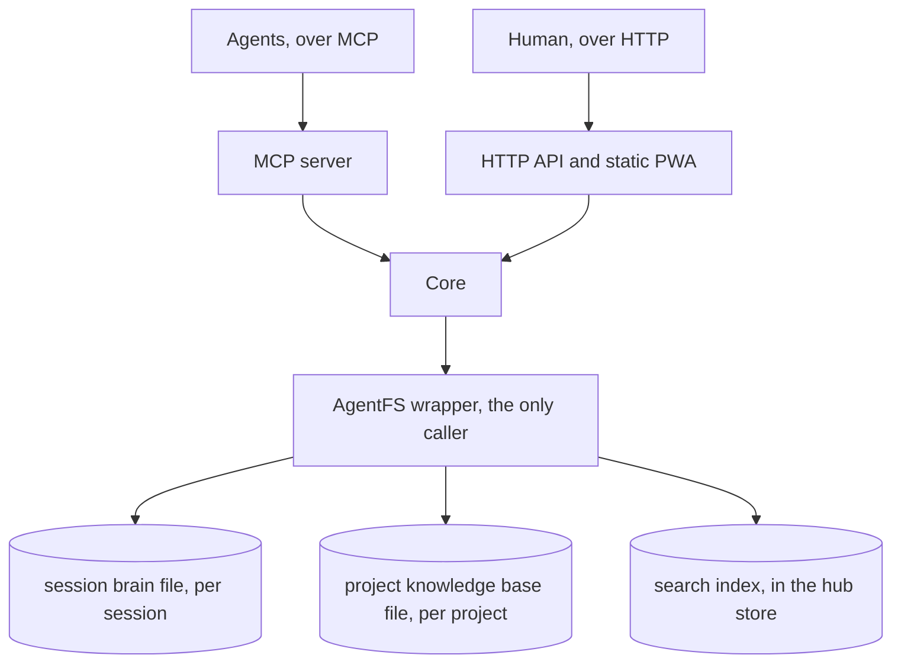

# Components

The hub is a single process with a small number of internal boundaries. This
page describes those boundaries and the constraints that hold across them.

## Process model

One Rust process serves three client-facing endpoints over a shared core:

- an **MCP server** for agents over streamable HTTP, reached on a LAN or
  tailnet, and over stdio for the standalone mode that serves a data directory
  no hub is running on. A harness that speaks only stdio reaches a running hub
  through the client proxy in the same binary;
- an **HTTP API** for the human surface, with the PWA served as static assets
  from the same binary;
- the **core**, which owns the event store, authentication and authorization,
  and search.

The AgentFS wrapper sits between the core and the AgentFS files, one per
session and one per project. It holds one write handle per file, so writes to a
given file are serialised by construction and cross-session conflicts are
structurally impossible. The hub event store runs under the engine's concurrent journal
mode. The wrapper is also the single place that writes the search index, on
every change it makes.

## Boundaries

- **Agents never touch files.** An agent speaks MCP to the wrapper, which is
  the single writer for a file, a session brain and a project knowledge base
  alike. There is no path by which an agent opens one directly.
- **The wrapper is the only AgentFS caller.** No other component embeds or
  reimplements AgentFS; the hub wraps it. The SDK is vendored so its engine
  matches the hub's single pinned engine.
- **One engine version links.** The build fails if the dependency tree contains
  two engine versions, which is what vendoring the SDK prevents (see
  [decision 0010](../adr/0010-one-pinned-engine.md)).
- **Search lives in the hub store.** One full-text index over a search
  documents table, written through by the wrapper, so no cross-file search is
  needed. Document bodies are clamped to the maximum search body bytes on UTF-8
  boundaries upon indexing to preserve integrity. The index method is enabled
  explicitly on the engine connection because it is behind an experimental flag.
- **Schema migrations run in single-writer mode.** Data definition statements
  are not allowed inside a concurrent write transaction, so migrations take
  the single-writer path.
- **Hub store writers queue for the write lock.** Every write to the hub
  store, a transaction or a single statement, first takes a turn in one fair
  in-process queue, so writers take the engine's write lock in the order they
  asked for it. The engine's busy handler retries on a backoff and is not a
  queue: on its own it lets a waiter miss every free moment behind writers that
  commit and begin again back to back. A writer gives up only when no turn has
  been granted for the whole lock wait, which means one holder kept the lock
  that long. A writer that waited its turn reads the committed key and replays
  to the same event or artifact instead of surfacing the lock as an error.
- **The busy handler bounds contention from outside the queue.** The store
  opens every connection through one helper that sets the same bounded wait,
  because the handler is per-connection and the builder has no timeout. Inside
  the queue a writer rarely meets the lock taken; the handler covers a
  connection that holds it without a turn, and bounds that wait too.
- **The storage facade is hygiene, not a swap seam.** It exists to keep the
  storage layer testable and portable. It is not engine-swap machinery; the
  engine is fixed.

## Deployment shape

The binary is the unit of deployment, whether run directly on a node or in a
scratch or distroless container as a non-root user with a read-only root
filesystem. Persistence is a single mounted data volume. Backups are taken
offline by `agent-hub backup`, online by the serving hub itself into a
configured directory outside the data volume, or as node or NAS snapshots (see
[Operations](../usage/operations.md#back-up)).

The default path is the plain container behind a reverse proxy, which owns
TLS. An optional build embeds a tailnet endpoint through `tailscale-rs`, behind
a cargo feature that is off by default, so the same binary can join a tailnet
in userspace and listen there with no open ports. That build is experimental:
the library has no tailnet name resolution or certificate issuance yet and its
NAT traversal is in progress, so it is addressed by tailnet IP, and the
tailnet carries plain HTTP inside the WireGuard tunnel, with no hub TLS (see
[decision 0014](../adr/0014-optional-embedded-tailnet.md)).

## See also

- [Data model](data-model.md) - what the components read and write
- [Decision 0002](../adr/0002-single-turso-engine.md) - why one engine
- [Decision 0003](../adr/0003-wrap-agentfs-per-session.md) - why the wrapper
  is the single writer
- [Decision 0010](../adr/0010-one-pinned-engine.md) - why the SDK is vendored
- [Decision 0014](../adr/0014-optional-embedded-tailnet.md) - the tailnet
  option
