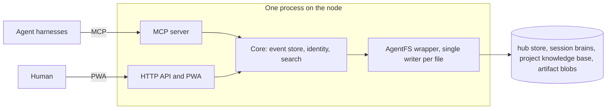

# Overview

This page describes what Agent Hub is for and how it is shaped. See
[goals and non-goals](design/goals.md) for the v1 boundary and the
[architecture](architecture/index.md) for the components.

## The problem

Agents lose working state when their context is compacted or the client
restarts. On top of that, a fleet that runs across several machines has no
shared, time-ordered account of what happened, and the human who supervises it
has no single calm queue for finished work and approval requests. Vendor
clouds solve some of this, but they move the data and the brain off the
machine.

## What Agent Hub is

Agent Hub is the self-hosted answer. It is one lean binary or container that
runs on a homelab or NAS node and acts as the central, cross-node hub for a
fleet of agents and their human. The node is the cloud: agents on any machine
report in over a LAN or tailnet, and there is no brain off the node and no
vendor service.

It offers four surfaces over one data model:

- **Session brains.** Each agent session gets a server-side, session-scoped
  store. Its life is bound to the session, so it survives same-session
  compaction and resume of the same named session.
- **A project feed.** A time-ordered, append-only, addressable event store per
  project. Agents read it on startup; the human reads it as a feed.
- **A global inbox.** One queue for the human: finished work, questions, and
  approvals, under async mailbox semantics.
- **Artifacts.** Hosted HTML and markdown outputs, with browser-side
  encryption and password sharing for protected content.

Behind the session brains sits the project knowledge base, the durable store
that makes the "remote brain" promise whole: one store per project, shared by
every agent with write access, holding pages a prune never touches, and backing
a wiki a human reviews and promotes into. It is the place knowledge goes when it
must outlive the session that learned it, so it is the long-lived half of the
brain the session store is the working half of. Its shape rests on
[ADR 0018](adr/0018-project-knowledge-base.md).

Agents reach the hub over the Model Context Protocol (MCP). The human reaches
it through an installable, mobile-first PWA. The adoption path, from connecting
a harness to [session start](usage/agents.md#session-start) and moving existing
notes over, is in [using the hub as a brain](usage/agents.md).

## How it is built

Two choices shape everything else. First, a single storage engine: the Turso
Database Rust engine backs the hub event store, the per-session AgentFS files,
the search index, and artifact metadata, so there is no two-engine split;
artifact blobs live on the data volume. Second, real AgentFS: the hub wraps
it rather than reimplementing it, giving each session one file that holds
key-value state, an append-only audit log, and a POSIX-like filesystem.

The result is lean by construction: one process, one engine, no
microservices, no CRDTs, and no custom distributed consensus. See the
[decision records](adr/index.md) for the reasoning.

## Status

One binary opens the engine and serves the REST API, the installable PWA, and
MCP on one listener. The feed, session brains, the project knowledge base and
its wiki, the inbox and questions, artifacts with reversible prune,
engine-native search, per-agent identity and confidential projects, the
container packaging, and an optional embedded tailnet exist. The pages describe
shipped behaviour and mark anything still intended design.
